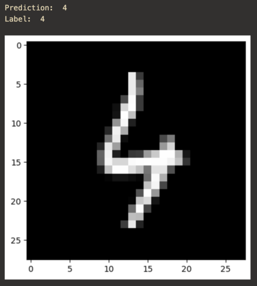

# Handwritten Digits Recognizer using Neural Network

A recognizer for the [MNIST dataset](http://yann.lecun.com/exdb/mnist/). This recognizer uses a neural network with 4 layers (2 hidden layers). The neural network was implemented from scratch without using any ML library, only using NumPy.

Check out the [doc](doc/) directory for details on the model.

