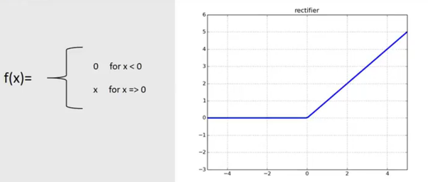
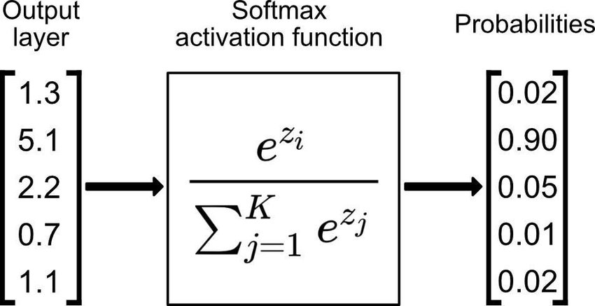

# Neural network

Our neural network will have 4 layers: 1 input layer, 1 output layer, and 2 hidden layers

- The input layer will have 784 nodes. Each of the 784 pixels in an image will be mapped to a node
- The 1st and 2nd hidden layer will each have 256 nodes
- The output layer will have 10 nodes. Each nodes representing a number from 0-9

# Forward propagation

This is the stage where we run the image from the input layer to the output layer. So we'll need to process the image for each layer

## Input layer

For the input layer, there's no processing, just taking in the data:

$$
A_0 = X \; (784 * m)
$$

## Hidden layers

For the 1st hidden layer, we need to compute the data based on the weights ($W_1$) and biases ($B_1$) of this layer ($Z_1$) and run it through an activation function ($A_1$), which will be ReLU:

$$
Z_1 = W_1 \cdot A_0 + B_1
$$

We need to to get the dot product of the weight and the inputs and add a bias. So we're just multiplying with a bunch of weights corresponding to each of the connections from the input layer to the 1st hidden layer, and then adding a bias term corresponding to each of the nodes in the hidden layer

After this, we need to apply an activation function. An activation function is important because it introduces nonlinearity and complexity into the model. If we didn't have this then each nodes would just be a linear combination of the nodes before with the bias term. This will make the hidden layers obsolete. Essentially, that just means you're just doing fancy linear regression.

I opted to use **ReLU** (Rectified Linear Unit) as my activation function. 

ReLU is quite simple but it's going to introduce another layer of complexity to the model which will make it more powerful.

So we can do this:

$$
A_1 = ReLU(Z_1)
$$

For the 2nd hidden layer, we do basically the same thing as the 1st hidden layer, we connect the output of the 256 nodes of the 1st hidden layer ($A_1$) to each of the 256 nodes in the 2nd hidden layer, compute the data with the weights and biases of the 2nd hidden layer and apply our activation function.

$$
Z_2 = W_2 \cdot A_1 + B_2
$$

$$
A_2 = ReLU(Z_2)
$$

## Output layer

For the output layer, we'll need to first add up the output of the last hidden layer with the weights and biases of the output layer:

$$
Z_3 = W_3 \cdot A_2 + B_3
$$

Then we'll apply an activation function just like in the hidden layer. However, the activation function that we'll use here will not be ReLU, it will be different. We'll be using **Softmax**. 

Because each of the nodes in the output layer corresponds to an output, we need to give each of these nodes a probability rating that will be computed based on $Z_3$. The output node with the highest probability will be the prediction of the model. 100% will be absolute certainty and 0% will be absolutely incorrect

This basically take the exponetiation of $e^{z_i}$, with $z_i$ being the ith node, and divide it by the sum of the exponentiation of all the nodes. This will give us an activation value between 0 and 1

# Backward propagation

In order for the model to predict accurately, we need to pick the correct weights and biases. And to do this, we'll the some optimization algorithm to make the program "learn" and modify it's own weights and biases and pick the best weights and biases possible.

Backward propagation means we're just going backwards compared to forward propagation. We start with the prediction and we'll find the error of the prediction compared to the answer, figure out the deviation. Then we'll figure out how much each weights and biases contributed to that error and adjust them accordingly.

First, we need to figure out how much the actual output deviated from the expected output (gradient of the loss)

$$
dZ_3 = A_3 - Y_h
$$

$dZ_3$ represents how much the output deviated from the actual label. We'll subtract the prediction ($A_3$) with the one-hot encoded label ($Y_h$) to get the gradient of the loss with respect to the output layer activations.

Next, we'll need to figure out how much the weights and biases contributed to this deviation so that we can adjust the weights and biases to minimize this loss

$$
dW_3 = \frac{1}{m} * dZ_3 \cdot A_2^{[T]}
$$

$$
dB_3 = \frac{1}{m} * \sum dZ_3
$$

$dW_3$ is the derivative of the loss with respect to the weights between layer 2 and 3. 

$dB_3$ is the average of the error.

We'll need to do the same thing for the 2nd hidden layer:

$$
dZ_2 = W_3^{[T]} \cdot dZ_3 * ReLU'(Z_2) 
$$

This is just propagation in reverse. We're taking the error from the output ($dZ3$) and apply the weights to it in reverse to get the errors for the 2nd hidden layer. Then we need to apply the derivative version of ReLU to undo the activation. 

After all that, we do the same thing as we did before:

$$
dW_2 = \frac{1}{m} * dZ_2 \cdot A_1^{[T]}
$$

$$
dB_2 = \frac{1}{m} * \sum dZ_2
$$

Finally, for the 1st hidden layer, we can do pretty much the same thing as the 2nd hidden layer (with $X$ being the data):

$$
dZ_1 = W_2^{[T]} \cdot dZ_2 * ReLU'(Z_1) 
$$

$$
dW_1 = \frac{1}{m} * dZ_1 \cdot X^{[T]}
$$

$$
dB_1 = \frac{1}{m} * \sum dZ_1
$$

# Updating the parameters

After we do the backward propagation, we need to update the parameters (weights and biases) accordingly with some simple equations:

$$
W_1 = W_1 - \alpha * dW_1
$$

$$
B_1 = B_1 - \alpha * dB_1
$$

$$
W_2 = W_2 - \alpha * dW_2
$$

$$
B_2 = B_2 - \alpha * dB_2
$$

$$
W_3 = W_3 - \alpha * dW_3
$$

$$
B_3 = B_3 - \alpha * dB_3
$$

Here, $\alpha$ is the learning rate. We'll hardcode this learning rate. We want to pick a good learning rate because too high a learning rate could cause the model to overshoot and lead to oscillations and too low a learning rate could cause the model to take a long time to achieve a good performance. 

# Training the model

We'll need to extract the data from the csv file and initialize some initial parameters for the weights and biases. Then we can train the model for $n$ amount of iterations so that the model can "learn" and adjust its parameters to achieve a good accuracy. For each iterations, we will run the forward propagation algorithm, then run the backward propagation algorithm, then update the parameters. 

# Testing the model

We'll run the model on the test dataset. We only need to use forward propagation for testing.
